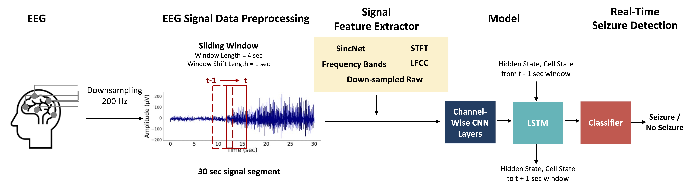

# Real-Time Seizure Detection using Electroencephalogram (EEG)

This is the repository for ["Real-Time Seizure Detection using EEG: A Comprehensive Comparison of Recent Approaches under a Realistic Setting"](https://proceedings.mlr.press/v174/lee22a/lee22a.pdf). You can checkout [pdf file](paper/Real-Time%20Seizure%20Detection%20using%20EEG-A%20Comprehensive%20Comparison%20of%20Recent%20Approaches%20under%20a%20Realistic%20Setting.pdf) of our paper in our github repo.

- If you have used our code or referred to our result in your research, please cite:
```
@inproceedings{lee2022real,
  title={Real-Time Seizure Detection using EEG: A Comprehensive Comparison of Recent Approaches under a Realistic Setting},
  author={Lee, Kwanhyung and Jeong, Hyewon and Kim, Seyun and Yang, Donghwa and Kang, Hoon-Chul and Choi, Edward},
  booktitle={Conference on Health, Inference, and Learning},
  pages={311--337},
  year={2022},
  organization={PMLR}
}
```

## Real-Time EEG Detection
We downsample the EEG signal and extract features. The models detect whether ictal / non-ictal signal appears within the 4-second sliding window input. We present an example case with Raw EEG signal but other signal feature extractors can also be applied in the pipeline.


## Requirements
*   [PyTorch 1.8.1+cu102](http://pytorch.org/)

To install all the requirements of this repository in your environment, run:
```
pip install -r requirements.txt
```

## Preprocessing
    
To construct dataset with [TUH EEG dataset](https://www.isip.piconepress.com/projects/tuh_eeg/), you can download EEG Seizure Corpus in the website and save it to *$PATH_TO_EEG* and run: 
```
python preproces.py --data_type train --cpu_num *available cpu numbers* --label_type  *tse or tse_bi* --save_directory *path to save preprocessed files* --samplerate *sample rate that you want to re-sample all files*
```
Before running the code, please change *$PATH_TO_EEG/* to your own path to EEG raw dataset.

## Model Training

Check our **builder/models/detection_models** or **builder/models/multiclassification** repository to see available models for each task. To train the model in default setting, run a command in a format as shown below :  
```
CUDA_VISIBLE_DEVICES=*device number* python ./2_train.py --project-name *folder name to store trained model* --model *name of model to run* --task-type *task*
```
For sincnet settin, add *--sincnet-bandnum 7*

Example run for binary seizure detection:
```
CUDA_VISIBLE_DEVICES=7 python3 ./2_train.py --project-name alexnet_v4_raw --model alexnet_v4 --task-type binary --optim adam --window-size 4 --window-shift 1 --eeg-type bipolar --enc-model raw --binary-sampler-type 6types --binary-target-groups 2 --epoch 8 --batch-size 32 --seizure-wise-eval-for-binary True
```
```
CUDA_VISIBLE_DEVICES=7 python3 ./2_train.py --project-name cnn2d_lstm_raw --model cnn2d_lstm_v8 --task-type binary --optim adam --window-size 4 --window-shift 1 --eeg-type bipolar --enc-model raw --binary-sampler-type 6types --binary-target-groups 2 --epoch 8 --batch-size 32 --seizure-wise-eval-for-binary True
```
Example run for SincNet signal feature extraction :
```
CUDA_VISIBLE_DEVICES=7 python3 ./2_train.py --project-name alexnet_v4_raw_sincnet --model alexnet_v4 --task-type binary --optim adam --window-size 4 --window-shift 1 --eeg-type bipolar --enc-model sincnet --sincnet-bandnum 7 --binary-sampler-type 6types --binary-target-groups 2 --epoch 8 --batch-size 32 --seizure-wise-eval-for-binary True
```
Other arguments you can add :
1. enc-model : preprocessing method to extract features from raw EEG data (options: raw, sincnet, LFCC, stft2, psd2, downsampled)
                psd2 is for Frequency bands described in our paper
                stft2 is for short-time fourier transform
2. seizure-wise-eval-for-binary : perform seizure-wise evaluation for binary task at the end of training if True
3. ignore-model-summary : does not print model summary and size information if True
    model summary is measured with [torchinfo](https://github.com/TylerYep/torchinfo)
Please refer to **/control/config.py** for other arguments and brief explanations. 

## Model Evaluation
We provide multiple evaluation methods to measure model performance in different perspectives. This command will measure the model's inference time in seconds for one window.
```
python ./3_test.py --project-name *folder where model is stored* --model *name of model to test* --task-type *task*
python ./4_seiz_test.py --project-name *folder where model is stored* --model *name of model to test* --task-type *task*
```
# Test and measure model speed 
To evaluate the model and measure model speed per window using cpu, run the following command :
```
CUDA_VISIBLE_DEVICES="" python ./3_test.py --project-name *folder where model is stored* --model *name of model to test* --cpu 1 --batch-size 1
```
For sincnet setting, add *--sincnet-bandnum 7*
**4_seiz_test.py** is for evaluation metrics of OVLP, TAES, average latency, and MARGIN

Other arguments you can add :
1. ignore-model-speed : does not calculate model's inference time per sliding window if **True**

 

